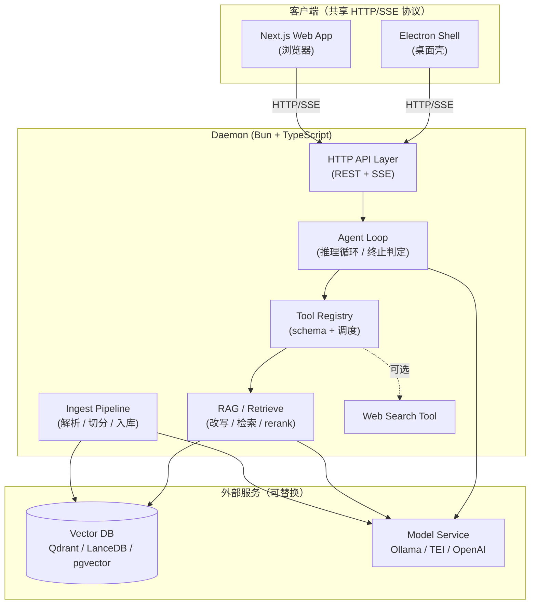

# 架构总览

## 进程拓扑

```
   ┌──────────────────┐          ┌──────────────────┐
   │  Electron Shell  │          │  Next.js Web App │
   │     (桌面壳)     │          │     (浏览器)     │
   └────────┬─────────┘          └────────┬─────────┘
            │                             │
            └─────────── HTTP / SSE ──────┘
                            │
                            ▼
   ┌────────────────────────────────────────────────────┐
   │            Daemon  (Bun + TypeScript)             │
   │                                                    │
   │   ┌────────────────────────────────────────────┐   │
   │   │  HTTP API Layer        (REST + SSE)        │   │
   │   └─────────────────┬──────────────────────────┘   │
   │                     ▼                              │
   │   ┌────────────────────────────────────────────┐   │
   │   │  Agent Loop            (推理 / 终止判定)   │   │
   │   └─────────────────┬──────────────────────────┘   │
   │                     ▼                              │
   │   ┌────────────────────────────────────────────┐   │
   │   │  Tool Registry         (schema / 调度)     │   │
   │   └─────┬────────────────────────────┬─────────┘   │
   │         ▼                            ▼             │
   │   ┌──────────────┐           ┌────────────────┐    │
   │   │ RAG/Retrieve │           │  Web Search    │    │
   │   │改写/检索/rerank│         │   (可选)       │    │
   │   └──────┬───────┘           └────────────────┘    │
   │          │                                         │
   │   ┌──────┴─────────────────────────────────────┐   │
   │   │  Ingest Pipeline   (独立路径：解析/切分/入库)│ │
   │   └──────┬─────────────────────────────────────┘   │
   └──────────┼─────────────────────────────────────────┘
              │
         ┌────┴─────┐
         ▼          ▼
   ┌──────────┐ ┌────────────────┐
   │Vector DB │ │ Model Service  │ ◀── Agent Loop / RAG /
   │ Qdrant / │ │ Ollama / TEI / │     Ingest 都通过 HTTP
   │ LanceDB /│ │ OpenAI         │     调用模型服务
   │ pgvector │ │                │
   └──────────┘ └────────────────┘
```

> 下面的 Mermaid 版本与上图等价，在支持渲染的工具里（GitHub / VS Code preview / Obsidian 等）会显示成可视化图。



## 模块边界

| 模块 | 职责 | 关键依赖 |
|------|------|----------|
| HTTP API Layer | 对外接口、SSE 流式输出 | Hono |
| Provider 层 | LLM provider 抽象 + 凭据存储 + 各家 adapter（按 providerId 路由 chat 请求） | `@anthropic-ai/claude-agent-sdk` / Vercel AI SDK |
| Agent Loop（Native） | 给非 Anthropic provider 跑的推理循环 / 工具调度 / 终止判定 | Vercel AI SDK |
| Tool Registry | 工具注册、参数 schema 校验、并发执行、超时与重试 | Zod |
| RAG / Retrieve | 查询改写、向量检索、rerank、上下文拼装 | 向量库 client（待定） |
| Ingest Pipeline | 文档解析、切分、embedding、写入向量库 | 解析库（按文档类型） |

## 双轨 Agent 执行

按 `providerId` 路由到两条执行路径，对外暴露**同一种 SSE 事件流**（`text-delta` / `tool-call` / `tool-result` / `done` / `error`）：

| 路径 | 适用 provider | 实现 |
|------|--------------|------|
| **Native loop** | OpenAI / Qwen / GLM / Kimi / DeepSeek / Ollama | Atlas 自己跑 ReAct 循环，调 Vercel AI SDK 的 `streamText({ tools, maxSteps })` |
| **Claude SDK passthrough** | `anthropic-claude-cli`（订阅模式） | 整轮 agent loop 委托给 `@anthropic-ai/claude-agent-sdk` 的 `query()`；spawn 时 env 必须**剥掉** `ANTHROPIC_API_KEY` 才能走订阅而非 API 计费 |

不写统一的 loop 抽象去包两条路径——SDK 不暴露裸调 LLM 接口，强抽象只会做出个错位的中间层。

## 多 agent 与一次性任务

未来会出现多个角色（plan / build / title / summary / compaction），但它们不是同一种东西，分两层：

| 层 | 角色 | 特性 |
|----|------|------|
| **agents/**（loop） | plan、build | 多步推理、可调工具、产出 SSE 事件 |
| **tasks/**（one-shot） | title、summary、compaction | 单次 LLM 调用、输入→字符串/对象、无 tool registry |

两层共用底层 provider，但接口形状不同。**所有调用都通过 `RoleResolver.resolve(name)` 拿 `{ providerId, model }`**，调用方不直接读 config。这让"给 title 单独配个便宜模型"成为一行 config 改动。

当前已落地：
- `title`（首轮 user+assistant 后异步生成会话标题）
- `compaction`（每轮调 provider 前估字符数；超阈值时把"老消息"换成一条 `system` 总结，保留最近 K 条原文）

## 关键决策

| 决策 | 选择 | 理由 |
|------|------|------|
| 后端语言 | **TypeScript** | 与前端共享类型；外置模型服务后 ML 生态差距消失 |
| Runtime | **Bun** | 内置 TS / 测试 / SQLite / 打包；启动快；`bun build --compile` 便于桌面分发 |
| 包管理 | **Bun**（内置） | 与 runtime 同源，零额外配置 |
| Monorepo | **Turborepo**（配合 Bun workspaces） | pipeline 缓存 + 跨包并发；轻量、增量 |
| HTTP 框架 | **Hono** | 类型推导最强；SSE 一等公民；与 Bun 适配良好 |
| 模型托管 | **外部 HTTP 服务** | Ollama / TEI / 云 API 可热替换；进程解耦；无需把模型 inline 到 daemon |
| 通信协议 | **HTTP + SSE** | Web 与桌面通用；流式简单；不需要 WebSocket 全双工 |
| 复杂文档解析 | **允许独立工具/脚本** | Ingest 路径冷、可批处理；语言边界不影响主进程；Python/外部 CLI 都可用 |
| Web 框架 | **Next.js** | 用户已确认 |
| 桌面 | Electron（**当前阶段暂缓**） | 仅作为壳；与 daemon 通过 HTTP 通信；先把后端跑通再做 |
| Agent Loop（native） | **Vercel AI SDK** | provider 抽象 + 流式 + tool calling + maxSteps 一站式；多家 LLM 不需要自己写 SSE 解析 |
| Anthropic 订阅接入 | **Claude SDK passthrough** | 订阅 OAuth 凭据躺在本机 `claude` CLI 里，没有"裸调 LLM"接口可走；只能 spawn SDK 让它跑整轮 loop |
| 应用数据目录 | **`~/.atlas/`**（可由 `ATLAS_HOME` 覆盖） | 单一 root 收纳配置 / 凭据 / 会话；环境变量覆盖便于测试隔离与多 profile |
| 应用配置 | **`~/.atlas/config.json`** | 起步放 daemon port、`defaults` provider/model、`sessions.dir`、`roles` 表；hand-edit 即可 |
| 多 agent 路由 | **role-based 配置** | `defaults` 给底，`roles.<name>` 单条覆盖 providerId/model；调用方走 `RoleResolver.resolve(name)`，不直接拼 providerId |
| Provider 凭据存储 | **`~/.atlas/credentials.json` + 0600** | 早期单机单用户；不上 keychain（YAGNI），后续多端共享时再换 |
| 会话持久化 | **per-session JSON 文件**（默认 `~/.atlas/sessions/<id>.json`） | 一会话一文件、原子 rename 写入；本地几百会话足够；`config.sessions.dir` 可改路径，未来要 PG 直接换 store 实现 |
| 向量库 | 待定 | 实现 RAG 时再决（候选：LanceDB / Qdrant / pgvector） |

## 数据流：一次问答

1. 客户端 `POST /chat` 携带 `message`（单条新 user 消息）+ 可选 `sessionId`；首轮无 `sessionId` 时必须给 `providerId`/`model`，daemon 会新建 session
2. daemon 从 session store 读出历史 messages，把新 user 消息追加并落盘
3. Provider 层按 session 的 `providerId` 路由：要么走 native loop，要么委托给 Claude SDK passthrough
4. Agent Loop 启动，整段 messages 进入推理
5. LLM 决定调用 `retrieve` 工具 → RAG 模块查询向量库（必要时 rerank）
6. 检索结果作为 tool result 回灌到对话
7. （可选）LLM 调用 `web_search` 补充信息
8. LLM 输出最终答复，通过 SSE 流式回客户端；流结束后 daemon 把 assistant 文本追加进 session
9. 响应头 `X-Atlas-Session-Id` 始终携带本轮 session id（新建/复用都给）

## 数据流：文档摄入

独立路径，与问答路径解耦。允许离线/批处理。

1. 用户提交文档（CLI / UI 拖拽 / 监听文件夹，方式待定）
2. Ingest Pipeline 调用解析器拿到结构化文本（PDF/扫描件可走外部工具）
3. 切分为 chunks → 调用 embedding 模型服务
4. 写入向量库，附元信息（来源、时间、权限标签）

## 待定项

- 鉴权方案（本地无需，多端共用时怎么处理）
- 文档 ingest 的触发方式（CLI / UI 拖拽 / 文件夹 watcher）
- 桌面端是否内嵌 daemon 进程，还是后台服务方式
- 工具扩展机制（插件 / MCP / 内置）
- 会话存储后端从 file 切到 PG / SQLite 的触发条件（当前 file 够用）

> 待定项有结论时，更新本表并把决策迁到「关键决策」表。
